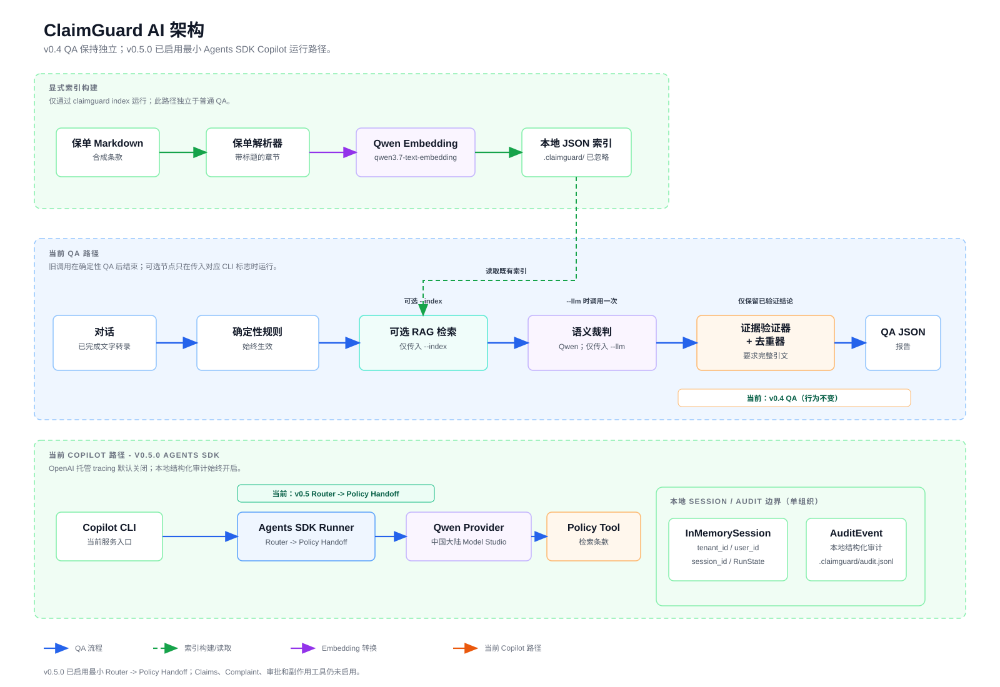
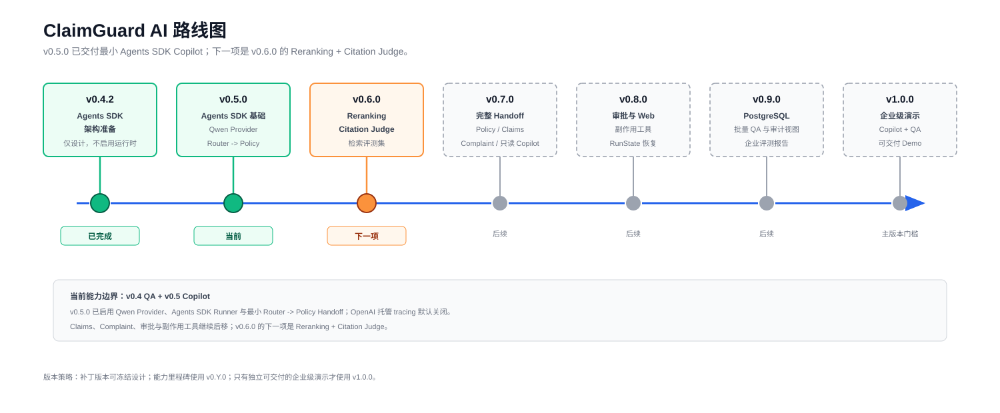

# ClaimGuard AI

Insurance text customer service Copilot and AI quality assurance system.

ClaimGuard AI is a focused GitHub demo project for text-based insurance service. It does not handle calls, ASR, speaker diarization, OCR, video, or outbound dialing. V1 concentrates on two inputs:

1. A customer message currently being handled by an online service agent.
2. A completed text conversation that needs quality inspection.

## Architecture



The current `v0.4.0` core combines deterministic QA, optional RAG grounding,
and an opt-in semantic judge for completed Chinese conversations. The semantic
judge runs once only when an operator supplies `--llm`; the default CLI remains
offline. Citation judgment, reranking, Copilot generation, and web/API
endpoints remain future milestones. The QA report contract remains stable.

## V1 Product

### Customer Service Copilot

The Copilot workflow helps an agent answer a customer during an active chat.

- Detect customer intent, such as claim amount dispute, denial explanation, policy clause lookup, or complaint.
- Retrieve relevant insurance knowledge.
- Draft a clear, compliant, clause-grounded reply.
- Warn the agent about risky phrases, unsupported commitments, and impatient wording.

### Quality Assurance

The QA workflow reviews completed conversations.

- Produce a quality score.
- Run semantic, process, and knowledge-grounded rules.
- Show violated rule IDs, risk levels, evidence, and reasoning.
- Suggest a better reply grounded in the correct policy clause.

## V1 Target Rule Matrix

`SEM-002` through `SEM-005` are active when the operator explicitly supplies
`--llm`. The deterministic runner and RAG grounding remain available without a
semantic model call. `SEM-001`, process normalization, and citation judgment
remain deferred.

| Rule ID | Rule | Category | Risk | Detection |
| --- | --- | --- | --- | --- |
| SEM-001 | Counter-questioning the customer | Semantic | Critical | LLM judge (future) |
| SEM-002 | Answer does not address customer intent | Semantic | Critical | Qwen semantic judge (`--llm`) |
| SEM-003 | Impatient service tone | Semantic | Critical | Qwen semantic judge (`--llm`) |
| SEM-004 | Complaint not acknowledged or soothed | Semantic | Critical | Qwen semantic judge (`--llm`) |
| SEM-005 | Unapproved commitment | Semantic | Critical | Qwen semantic judge (`--llm`) |
| PROC-001 | Incomplete identity disclosure | Process | High | Rule + LLM (future) |
| PROC-002 | Missing closing statement | Process | Low | Rule + LLM (future) |
| RAG-001 | Claim amount dispute: deductible | Knowledge-grounded | Medium | Deterministic RAG evidence |
| RAG-002 | Pre-policy or waiting-period treatment denial | Knowledge-grounded | Medium | Deterministic RAG evidence |
| RAG-003 | Disease outside policy coverage | Knowledge-grounded | Medium | Deterministic RAG evidence |
| RAG-004 | Accident definition explanation | Knowledge-grounded | Medium | Deterministic RAG evidence |
| RAG-005 | Dynamic clause citation for pet insurance denial | Knowledge-grounded | High | Intent + RAG evidence + Citation judge (future) |

`RAG-005` is the V1 target hero case because it is intended to demonstrate
intent routing, retrieval, citation accuracy, and grounded answer quality in
one scenario. In v0.4 it attaches retrieved clause evidence only; citation
accuracy remains a future Citation Judge capability.

## Technical Direction

V1 should stay small and explicit:

```text
Router
  -> Knowledge workflow: RAG, citation grounding, answer drafting
  -> QA workflow: rule selection, judgment, evidence, scoring
```

The project should show product judgment, not agent sprawl. A compact workflow is easier to explain, test, and extend than a large multi-agent graph.

## Current Milestone

Current package version: `0.4.0`.

M2 adds the first deterministic rule runner. QA findings now come from conversation text instead of the fixture's `expected_risks` field. The fixture field remains as test oracle data while LLM behavior is still under development.

`v0.2.1` is a documentation patch that adds README architecture and roadmap diagrams.

`v0.2.2` is a documentation patch that records the maintained agent
orchestration and domestic model defaults in `docs/agent-orchestration.md`.

`v0.3.0` adds deterministic Chinese policy grounding: a policy parser and
validated local index, Qwen `qwen3.7-text-embedding` retrieval, five supported
RAG rules, retrieval evidence on QA findings, and backward-compatible CLI
commands for index creation and grounded QA. It does not add LLM judges,
reranking, or citation-accuracy judgment.

`v0.3.1` adds an ignored project-local `.env` fallback for Model Studio
configuration. Explicit process environment variables still take priority.

`v0.4.0` adds opt-in Semantic QA for `SEM-002` through `SEM-005`. With
`--llm`, one Qwen `qwen3.7-plus` structured-output request evaluates a
completed conversation. A semantic finding is emitted only when its evidence
is an exact, complete customer-service message in that conversation; provider
or contract failures return an error instead of unvalidated findings.

## Repository Layout

```text
docs/                       product scope and architecture notes
data/knowledge/             synthetic policy fixtures
examples/conversations/     demo conversation fixtures
src/claimguard/             Python package
tests/                      automated tests
```

## Versioning

Release tags use `vX.Y.Z`.

- Small fixes use `v0.0.Z` style patch bumps.
- Larger feature milestones use `v0.Y.0` minor bumps.
- Major `vX.0.0` releases are reserved for genuinely deliverable demo milestones.

See `docs/versioning.md` for the project policy.

## Quick Start

Run the current QA CLI demo:

```bash
PYTHONPATH=src python3 -m claimguard.cli examples/conversations/claim-amount-dispute.json
```

Build a local policy knowledge index for grounded QA. Copy the local template,
then put a Model Studio API key in `.env`. The file is ignored by Git:

```bash
cp .env.example .env
# Edit .env locally: DASHSCOPE_API_KEY=your-key
PYTHONPATH=src python3 -m claimguard.cli index data/knowledge/petcare-plus-policy-zh.md \
  --output .claimguard/petcare-plus-policy.json
```

Run QA with the generated index:

```bash
PYTHONPATH=src python3 -m claimguard.cli examples/conversations/zh-deductible-dispute.json \
  --index .claimguard/petcare-plus-policy.json
```

The generated index is stored in `.claimguard/petcare-plus-policy.json`.
API keys and generated indexes are intentionally not committed. When set, an
explicit process environment variable overrides the same value in `.env`.

See `docs/m3-rag-grounding.md` for the supported Chinese cases, index
lifecycle, operator commands, and current limitations.

Run semantic QA against the dedicated Chinese fixture:

```bash
PYTHONPATH=src python3 -m claimguard.cli examples/conversations/zh-semantic-qa.json --llm
```

This is an explicit paid network call to Model Studio. It reuses the ignored
local `.env` configuration (or explicit process environment variables), so no
API key belongs in the command, fixture, or Git history. The semantic judge
requires complete quote-backed evidence from an agent message. If its request
or response cannot be validated, the command fails without producing semantic
findings. See `docs/m4-semantic-qa.md` for the operating contract and limits.

The command returns a JSON QA report with:

- `conversation_id`: reviewed conversation fixture ID.
- `scenario`: demo case description.
- `score`: deterministic quality score.
- `findings`: rule findings with rule ID, category, risk level, evidence, and recommendation.

Run the test suite:

```bash
python3 -m unittest discover -s tests
```

Load the V1 rule catalog:

```python
from claimguard.rules import load_rule_catalog

catalog = load_rule_catalog()
print(catalog.get("RAG-005").name)
```

## Roadmap



The roadmap keeps small documentation or fixture updates in patch releases, while capability milestones move the minor version forward.
