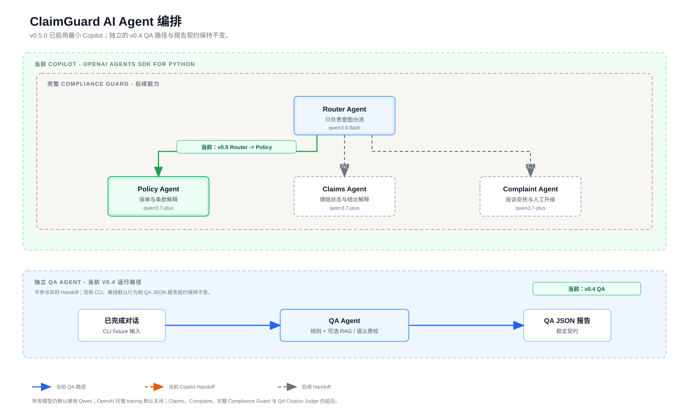

# Agent Orchestration

ClaimGuard AI keeps its agent topology compact: one implemented QA workflow for
completed conversations, plus a future Copilot workflow for active customer
service. Specialized capabilities remain workflow nodes, not product-facing
agents.

## Current v0.4.0 QA Workflow

```text
Conversation
  -> Deterministic Rules + optional RAG retrieval
  -> (--llm only) Semantic Judge
  -> Evidence Validator + Deduplicator
  -> QA JSON Report
```

The deterministic rule runner is always executed. Optional RAG contributes
retrieved clause evidence only when a local index is supplied. `--llm` creates
one Qwen semantic judge for the completed conversation; otherwise no semantic
model client or request exists. The validator accepts semantic evidence only
when it is one complete agent message in the transcript, and the deduplicator
preserves an existing deterministic result for the same rule ID.

Index construction is a separate explicit operation:

```text
Policy Markdown -> Policy Parser -> Qwen Embedding -> ignored Local Knowledge Index
```

It is not part of the default QA command. Query-time RAG reads the existing
index only when the operator supplies `--index`.



## Product Agents

### QA Agent (Current)

The implemented QA Agent reviews completed conversations and produces a stable
JSON report with score, rule findings, evidence, recommendation, optional
retrieved clause, and optional semantic `reasoning`, `confidence`, and
`judge` fields.

Its active semantic scope is intentionally narrow: `SEM-002` through
`SEM-005` cover answer relevance, impatient tone, complaint acknowledgement,
and unsupported commitments. A model error produces no unvalidated semantic
finding.

### Copilot Agent (Deferred)

The future Copilot Agent will assist a service representative during an active
chat. Its intended outputs are customer intent, recommended clause, suggested
reply, and risk warnings. It is not implemented in `v0.4.0`.

## Domestic Model Defaults

For cost and compliance-sensitive insurance service scenarios, ClaimGuard AI
defaults to Alibaba Cloud Model Studio / Qwen. The intended deployment region
is mainland China, such as `cn-beijing`, when API access is configured.

| Capability | Default Model | v0.4.0 Status |
| --- | --- | --- |
| Semantic Judge | `qwen3.7-plus` | Active only with `--llm` |
| Embedding | `qwen3.7-text-embedding` | Active for index creation and `--index` retrieval |
| Intent Router | `qwen3.8-flash` | Deferred |
| Rule Selector | `qwen3.8-flash` | Deferred |
| Citation Judge | `qwen3.7-plus` | Deferred |
| Risk Guard | `qwen3.7-plus` | Deferred with Copilot |
| Reply Writer | `qwen3.7-plus` | Deferred with Copilot |
| Hard Case Judge | `qwen3.8-max` | Deferred |
| Reranking | `qwen3-rerank` | Deferred |

The semantic request uses strict JSON Schema, `temperature: 0`, and disabled
thinking. A local `CLAIMGUARD_SEMANTIC_MODEL` setting may override the semantic
model. Configuration stays in ignored `.env` or explicit process environment
variables; credentials are never report data or repository content.

## Deferred Topology

Citation Judge, reranking, Copilot generation, persistent storage, and web/API
endpoints are intentionally deferred. RAG retrieval evidence identifies a
selected clause; it is not a citation-accuracy finding. The v0.4 diagram shows
these as future extensions rather than active runtime components.

## Design Principles

- Keep the public architecture to two product agents.
- Keep specialized steps as workflow nodes unless they need separate state,
  policy, or ownership.
- Prefer structured JSON outputs for judgments and reports.
- Keep evidence traceable: deterministic matches, complete semantic quotes,
  and retrieved clause metadata stay visible in the report.
- Keep deterministic rules, semantic judgment, RAG, and fixtures independently
  testable.
- Use China-local providers by default for cost and compliance; document a
  provider or model change before implementation.

## Update Policy

Update this document and the orchestration diagram whenever product-agent
topology, default models, report contract, RAG evidence format, local-data
assumptions, or deferred-vs-active boundaries change.
